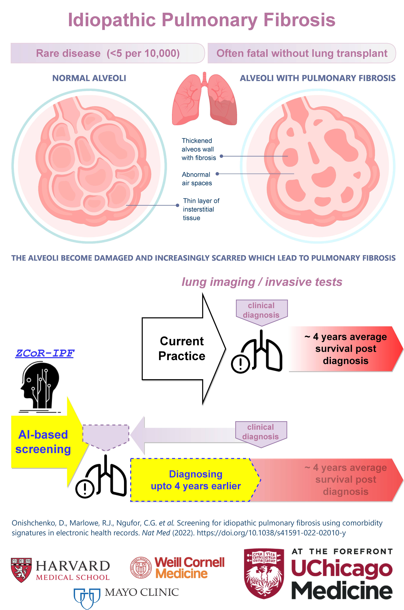
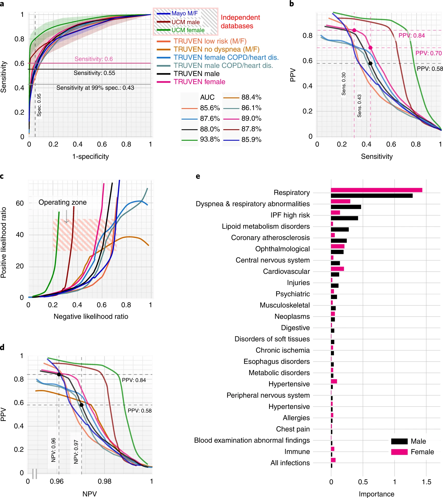
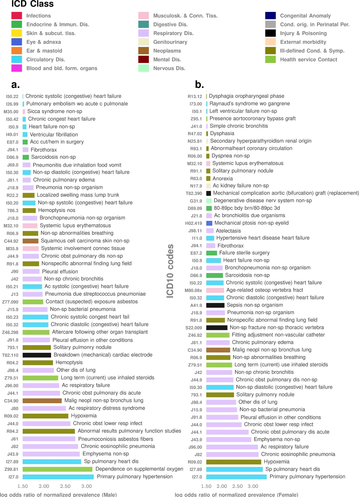
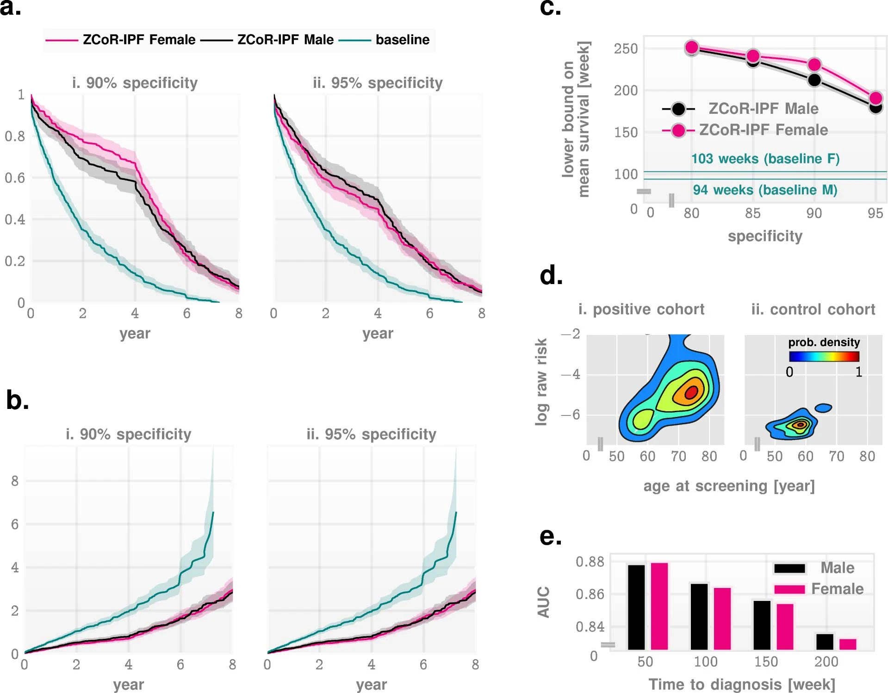
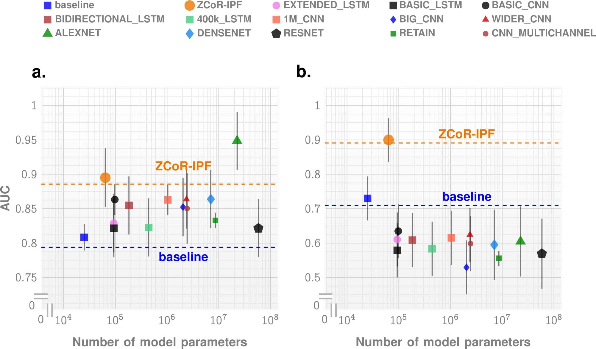

# NIH IPF Stakeholder Summit

+ Anna podolanczuk
+ David Schwartz
+ Ivan Rosas: Moderator
+ PFF Ambassador Mark McCormick

* identifying oatients before ILD helps to find a cure or prevent IPF development
* start using new diagnostic definitions might be very useful to identify patients and better charecrize the disease
* david schwartz.. screening can be better
* mark also pointed out the gaps in diagnostic workflows
* there are treatments for early IPF
* pre-clinical IPF 25% prevalence (david schwatrz)
* psychological impact might not be that important
* minimally complex genetic disease

-----
Morningeveryone. Let me begin by saying I am excited to be part of this summit, and it has been an aboslutely fascinating learning experience. A huge thanks to Fernando and Sydney for inviting me, and alosto the 3 lakes foundation and PFF and NHLBI for making this happen. 

So what I am going to talk about is our recent results on the possibility of accelerating the diagnostic odessey for patients to reach a aignosis, and may maybe avoid or at least the odds of the delays that patients like Mark sometimes face. IPF is of course is very bad disease to have with interventions that weel, as we have heard, are increasingly promising, but not poerfect. And we have heard that it can be hard to diagnose the disorder, symptims are non-specific, shortness of breath, dry cough, unless you can hear the crackles. And it is sort of rare, ILD about 10 of 10,000, ipf 5 of 10,000, But over 200,000 people are living now with IPF, and postDX survival is about 4-5 years. 

55% get at least one misdiagnoses, more than 38% two or more misdiagnoses, and often confused with age.  often confused with asthma, pnenomia, bronchitis, allergies , COPD, and simple CXR might not be conclusive. And on top of that, particualrly due to the workload of teh PCPs, signs are missed, leading to delayed and missed diagnosis

What we were able to do is look at EHR records and potentially bring back the diagnosis by 4 year before what is done in current practice. It is retrospective data.

---

# One line:

Predictive screening of IPF upto 4 years before diagnosis by current medical practice

## abstract lay

Using nearly 3 million patients from three independent patient databases, we uncovered
predictive comorbidity signatures in past 2 years of individual history of medical encounters to reliably flag  patients who go on to get a clinical diagnosis for IPF in future. The algorithm is demonstrated to make clinically useful predictions upto 4 years in future, and when applied 1 year before diagnosis we achieve out-of-sample positive likelihood ratios exceeding 30 at 99% specificity.  IPF, being a relatively rare disease (< 5 in 10,000), poses challenges to statistical characterization, and we developed new EHR processing tools to distill the subtle predictive signatures. We showed that longitudinal signals are important, and off-the-shelf deep learning tools tend to be less robust, especially when we move from one database to another without retraining. These results demonstrate the crucial role machine learning/AI can play in diagnosis of rare diseases, and that patterns buried in the medical histories can be effectively exploited to substantially improve patient outcomes.

## Point of care deployment:

ZCoR-IPF works noninvasively, inexpensively and almost instantaneously, relying only on diagnostic data already in the participant’s electronic medical record, and thus can run on existing information technology infrastructure.  ZCoR-IPF supplements information currently used to diagnose IPF, namely, respiratory signs and symptoms, pulmonary function and the radiographic and histologic appearance of the lung, reflecting a sophisticated, highly detailed automated analysis of comorbidities, considering more than 667 features related to the incidence and timing of individual diagnostic codes.

Our central claim in this study is the potential utility of ZCoR-IPF as a screening tool in the primary care setting, one that is deployable with little or no additional resources, thus improving delayed and missed diagnosis rates. Importantly, the goal of ZCoR-IPF in this setting is to flag participants for detailed diagnostic evaluation, and not to deliver a final diagnosis by itself.

Thus, ZCoR-IPF can aid primary care physicians to more selectively flag participants for referral for HRCT or to a pulmonologist. Presently, only high-risk participants are flagged, that is, participants with one or more of chronic dyspnea, chronic cough and/or chronic ‘Velcro crackles’ on auscultation, restrictive ventilatory patterns on pulmonary function tests or incidental ILAs or ILD on chest or abdominal CT.

Additionally, ZCoR-IPF can serve as a diagnostic aid for pulmonologists, radiologists, pathologists or multidisciplinary teams in cases showing abnormalities suggestive of, or associated with IPF, but not UIP on HRCT or histopathology.

## abstract results:

1. ZCoR-IPF was trained on a national insurance claims database and validated on three independent databases (Marketscan, UChicago Medicine hospital, Mayo Clinic), comprising a total of 2,983,215 participants, with 54,247 positive cases. The algorithm achieved positive likelihood ratios greater than 30 at a specificity of 0.99 across different cohorts, for both sexes, and for participants with different risk states and history of confounding diseases. The area under the receiver-operating characteristic curve for ZCoR-IPF in predicting IPF exceeded 0.88 and was approximately 0.84 at 1 and 4 years before a conventional diagnosis, respectively. 

2. ZCoR-IPF is demonstrated to have robust out-of-sample performance, allowing (1) accurate out-of-sample predictions for a future IPF diagnosis via leveraging subtle comorbidity patterns recorded in individual histories, (2) maintenance of high predictive performance for diagnosis further out, up to 4 years in future, and (3) common confounders to have little or no effect, such as a preexisting diagnosis of COPD, asthma or heart disease or the absence of any indication of dyspnea in the past. 

3. ZCoR-IPF outperforms baseline predictors and state-of-the-art neural network (NN) or deep learning architectures trained in the same manner as ZCoR-IPF

4. We concluded that past respiratory disorders maximally contribute to the risk, followed by suspected IPF comorbidities, metabolic diseases, cardiovascular abnormalities and diseases of the eye. Infections also featured in the top 20 comorbidities. Importantly, despite some differences, the overall pattern of the importance ranking remained substantially invariant across the sexes.

# Reddit:

ZCoR-IPF: Predictive screening of Idiopathic Pulmonary Fibrosis (IPF) upto 4 years before diagnosis by current medical practice

Using nearly 3 million patients from three independent patient databases, we uncovered
predictive comorbidity signatures in past 2 years of individual history of medical encounters to reliably flag  patients who go on to get a clinical diagnosis for IPF in future. The algorithm is demonstrated to make clinically useful predictions upto 4 years in future, and when applied 1 year before diagnosis we achieve out-of-sample positive likelihood ratios exceeding 30 at 99% specificity.  IPF, being a relatively rare disease (< 5 in 10,000), poses challenges to statistical characterization, and we developed new EHR processing tools to distill the subtle predictive signatures. We showed that longitudinal signals are important, and off-the-shelf deep learning tools tend to be less robust, especially when we move from one database to another without retraining. These results demonstrate the crucial role machine learning/AI can play in diagnosis of rare diseases, and that patterns buried in the medical histories can be effectively exploited to substantially improve patient outcomes.

ZCoR-IPF works noninvasively, inexpensively and almost instantaneously, relying only on diagnostic data already in the participant’s electronic medical record, and thus can run on existing information technology infrastructure.  ZCoR-IPF supplements information currently used to diagnose IPF, namely, respiratory signs and symptoms, pulmonary function and the radiographic and histologic appearance of the lung, reflecting a sophisticated, highly detailed automated analysis of comorbidities, considering more than 667 features related to the incidence and timing of individual diagnostic codes.

Our central claim in this study is the potential utility of ZCoR-IPF as a screening tool in the primary care setting, one that is deployable with little or no additional resources, thus improving delayed and missed diagnosis rates. Importantly, the goal of ZCoR-IPF in this setting is to flag participants for detailed diagnostic evaluation, and not to deliver a final diagnosis by itself. Thus, ZCoR-IPF can aid primary care physicians to more selectively flag participants for referral for HRCT or to a pulmonologist. Presently, only high-risk participants are flagged, that is, participants with one or more of chronic dyspnea, chronic cough and/or chronic ‘Velcro crackles’ on auscultation, restrictive ventilatory patterns on pulmonary function tests or incidental ILAs or ILD on chest or abdominal CT.

Additionally, ZCoR-IPF can serve as a diagnostic aid for pulmonologists, radiologists, pathologists or multidisciplinary teams in cases showing abnormalities suggestive of, or associated with IPF, but not UIP on HRCT or histopathology.

https://www.nature.com/articles/s41591-022-02010-y

# Linkedin:

ZCoR-IPF: Predictive screening of IPF upto 4 years before diagnosis by current medical practice

Using nearly 3 million patients from three independent patient databases, we uncovered
predictive comorbidity signatures in past 2 years of individual history of medical encounters to reliably flag  patients who go on to get a clinical diagnosis for IPF in future. The algorithm is demonstrated to make clinically useful predictions upto 4 years in future, and when applied 1 year before diagnosis we achieve out-of-sample positive likelihood ratios exceeding 30 at 99% specificity.  IPF, being a relatively rare disease (< 5 in 10,000), poses challenges to statistical characterization, and we developed new EHR processing tools to distill the subtle predictive signatures. We showed that longitudinal signals are important, and off-the-shelf deep learning tools tend to be less robust, especially when we move from one database to another without retraining. These results demonstrate the crucial role machine learning/AI can play in diagnosis of rare diseases, and that patterns buried in the medical histories can be effectively exploited to substantially improve patient outcomes.

ZCoR-IPF works noninvasively, inexpensively and almost instantaneously, relying only on diagnostic data already in the participant’s electronic medical record, and thus can run on existing information technology infrastructure.  ZCoR-IPF supplements information currently used to diagnose IPF, namely, respiratory signs and symptoms, pulmonary function and the radiographic and histologic appearance of the lung, reflecting a sophisticated, highly detailed automated analysis of comorbidities, considering more than 667 features related to the incidence and timing of individual diagnostic codes.

Our central claim in this study is the potential utility of ZCoR-IPF as a screening tool in the primary care setting, one that is deployable with little or no additional resources, thus improving delayed and missed diagnosis rates. Importantly, the goal of ZCoR-IPF in this setting is to flag participants for detailed diagnostic evaluation, and not to deliver a final diagnosis by itself. Thus, ZCoR-IPF can aid primary care physicians to more selectively flag participants for referral for HRCT or to a pulmonologist. Presently, only high-risk participants are flagged, that is, participants with one or more of chronic dyspnea, chronic cough and/or chronic ‘Velcro crackles’ on auscultation, restrictive ventilatory patterns on pulmonary function tests or incidental ILAs or ILD on chest or abdominal CT.

Additionally, ZCoR-IPF can serve as a diagnostic aid for pulmonologists, radiologists, pathologists or multidisciplinary teams in cases showing abnormalities suggestive of, or associated with IPF, but not UIP on HRCT or histopathology.

Results:

ZCoR-IPF was trained on a national insurance claims database and validated on three independent databases (Marketscan, UChicago Medicine hospital, Mayo Clinic), comprising a total of 2,983,215 participants, with 54,247 positive cases. The algorithm achieved positive likelihood ratios greater than 30 at a specificity of 0.99 across different cohorts, for both sexes, and for participants with different risk states and history of confounding diseases. The area under the receiver-operating characteristic curve for ZCoR-IPF in predicting IPF exceeded 0.88 and was approximately 0.84 at 1 and 4 years before a conventional diagnosis, respectively. 

ZCoR-IPF is demonstrated to have robust out-of-sample performance, allowing (1) accurate out-of-sample predictions for a future IPF diagnosis via leveraging subtle comorbidity patterns recorded in individual histories, (2) maintenance of high predictive performance for diagnosis further out, up to 4 years in future, and (3) common confounders to have little or no effect, such as a preexisting diagnosis of COPD, asthma or heart disease or the absence of any indication of dyspnea in the past. 

ZCoR-IPF outperforms baseline predictors and state-of-the-art neural network (NN) or deep learning architectures trained in the same manner as ZCoR-IPF

We concluded that past respiratory disorders maximally contribute to the risk, followed by suspected IPF comorbidities, metabolic diseases, cardiovascular abnormalities and diseases of the eye. Infections also featured in the top 20 comorbidities. Importantly, despite some differences, the overall pattern of the importance ranking remained substantially invariant across the sexes.

https://www.nature.com/articles/s41591-022-02010-y

--- 

--- 

--- 

--- 

