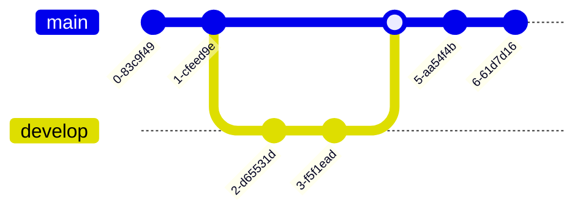

# Relation between power, significance

+ Significance level (\\\(\alpha\\\)): This is the probability of rejecting the null hypothesis when it is true. In other words, it represents the likelihood of making a Type 1 error, which is the incorrect rejection of a true null hypothesis. The significance level is generally set by the researcher, with common values being 0.05 (5%) or 0.01 (1%).
+ Type 2 error (\\\(\beta\\\)): This is the probability of failing to reject the null hypothesis when it is false. In other words, it represents the likelihood of making a false negative error, which is the incorrect acceptance of a false null hypothesis. The Type 2 error rate depends on factors such as the sample size, the effect size, and the test's statistical power.
+ \\\( \alpha \equiv FPR \equiv 1-specificity \equiv type \ 1 \ error\\\)
    - probability of rejecting null hypothesis when it is true ie false positive
+ \\\(\beta \equiv power \equiv TPR \equiv sensitivity \equiv 1-FNR \equiv 1-type \ 2 \ error \\\)
    - probability of correctly rejecting the null hypothesis ie true positive

## Meaning of 5% significance and 80% power

+ 5% significance level: This means that the false positive rate, or the probability of making a Type 1 error, is 5%. In other words, there's a 5% chance that you will incorrectly reject the null hypothesis when it is true, leading to a false positive result. The significance level is set by the researcher and is a threshold for determining whether an observed effect is statistically significant or not. A lower significance level (e.g., 1%) indicates a more stringent threshold and a lower chance of making a Type 1 error.

+ 80% power: Power is the probability of correctly rejecting the null hypothesis when it is false, i.e., the probability of detecting a true effect. If a test has 80% power, it means that there's an 80% chance that you will correctly identify a significant effect when it exists. The complement of the power is the Type 2 error rate or the false negative rate. In this case, the false negative rate is 20% (100% - 80%). This means that there's a 20% chance that you will fail to reject the null hypothesis when it is false, leading to a false negative result.

# Difference between senitivity (TPR) and power

Sensitivity and statistical power are related concepts, but they are used in different contexts: sensitivity is used in the context of diagnostic tests, while statistical power is used in hypothesis testing. Let's break down each concept:

+ Sensitivity: Sensitivity, also known as the true positive rate, is a measure of how well a diagnostic test can correctly identify individuals with a specific condition. It is the proportion of true positive results among those who actually have the condition. A higher sensitivity indicates that the test is better at detecting the presence of the condition when it is truly present, resulting in fewer false negative results.
    - Formula: Sensitivity = (True Positives) / (True Positives + False Negatives)

+ Statistical Power: Power is the probability of correctly rejecting the null hypothesis when it is false in the context of hypothesis testing. In other words, it represents the likelihood of detecting a true effect or association when it exists. A higher statistical power means that the test is better at identifying a significant effect when it is truly present, resulting in fewer Type 2 errors (false negatives).
    - Formula: Power = 1 - β, where β is the Type 2 error rate (false negative rate)

The difference between sensitivity and statistical power lies in their applications:

Sensitivity is used in the context of diagnostic tests to evaluate how well the test identifies true positives (people with the condition).
Statistical power is used in hypothesis testing to evaluate the ability of a test to detect a true effect or association when it exists.
Although both concepts are related to the ability to correctly identify true effects or conditions, they are applied in different fields and contexts.

# Ustatistic
+ [Use of U statistic](/uploads/mannU.pdf)
+ [Variance of U statistic](/uploads/boundsU.pdf)
+ [AUC CI cal]( /uploads/lorraines.pdf)
+ [one sample t tests]( /uploads/OneSampleTest_student.pdf)
+ [CI for 1-sample sensitivity and specificity](/uploads/Confidence_Intervals_for_One-Sample_Sensitivity_and_Specificity.pdf)
+ [CI for single proprtion]( /uploads/confidence_proportion.pdf)
+ [note on power calculations]( /uploads/stat_power_calculations_columbia.pdf)
+ [power discussion](https://machinelearningmastery.com/statistical-power-and-power-analysis-in-python/)
+ [Effect Size]( /uploads/effect_sizes.pdf)

# Confidence Bounds for sensitivity and specificity

Simple asymptotic method ('Wald method'~\cite{newcombe1994confidence,newcombe1998two}) without continuity correction is sufficient where the number of samples is large, and suffices here:

$
p \pm z \sqrt{\frac{p(1-p)}{n}}
$
where z is the \\\( 1 - \alpha/2 \\\) point of the standard Normal distribution. Replace with:
90% : 1.645, 95%: 1.96, 99%: 2.6

```
@article{newcombe1998two,
  title={Two-sided confidence intervals for the single proportion: comparison of seven methods},
  author={Newcombe, Robert G},
  journal={Statistics in medicine},
  volume={17},
  number={8},
  pages={857--872},
  year={1998},
  publisher={Wiley Online Library}
}

@article{newcombe1994confidence,
  title={Confidence intervals for a binomial proportion},
  author={Newcombe, Robert G and Vollset, Stein Emil},
  journal={Statistics in medicine},
  volume={13},
  number={12},
  pages={1283--1285},
  year={1994},
  publisher={Wiley Online Library}
}

```
# Confidence on PPV and NPV

https://www.ncbi.nlm.nih.gov/pmc/articles/PMC3668447/

# Sample Size Estimate in Diagnostic Trials

 [Sample size estimation in diagnostic test studies of biomedical
informatics](/uploads/powercalculation.pdf)

# Likelihood Ratios

The higher value of positive LR corresponds with greater information of positive test result while the
lower value of negative LR associates with more information of
negative test results. In particular, the positive and negative LR is
of greater interest in comparative studies of two diagnostic tests.

# ROC

For a quantitative diagnostic test or the test results are recorded on
ordinal scale, the sensitivity and specificity varies across the different
thresholds and the sensitivity is inversely related with specificity
[2,4,14]. Then, the plot of sensitivity versus 1-specificity is called receiver operating characteristic (ROC) curve and the area under the curve (AUC), as an effective measure of accuracy has been considered
and it has a meaningful interpretations [15]. This curve plays a central
role in evaluating diagnostic ability of tests to discriminate the true
state of subjects and comparing two alternative diagnostic tasks
when each task is performed on the same subject.

# Power Statement

The required sample sizes were calculated and tabulated with different levels of accuracies and
marginal errors with 95% confidence level for estimating and for various effect sizes with 80% power for
purpose of testing as well.


# Formula
Let \\\( d\\\) be the marginal error, and \\\( \rho\\\) is the prevalence, and \\\(s,c\\\) are sensitivity and specificity respectively, Then, we have:


Sample size based on sensitivity:
$
n_{s} = \frac{z^2_{\alpha/2} s (1-s) }{d^2 \rho}
$

Sample size based on specificity:
$
n_{c} = \frac{z^2_{\alpha/2} c (1-c) }{d^2 (1-\rho)}
$

# Power definition

For the purpose of testing, instead
of third element, the difference of sensitivity (or specificity) under
the null and alternative hypothesis is required (i.e. the maximum
difference to be detected in statistical test with power of \\\(1 - \beta \\\)
where b is the probability of type II error). Thus, the power of sta-
tistical test (the compliment of type II error) should be considered
the prior sample size calculation.

# Power calculation against existing test wrt sensitivity or specificity

At \\\(1-\beta\\\) power, and confidence \\\(\alpha\\\), we have:

$
n =\left ( \frac{z_{\alpha/2}\sqrt{p_0(1-p_0)} + z_{\beta}\sqrt{p_1(1-p_1)}}{p_0-p_1}\right)^2
$

where \\\(p_0,p_1\\\) are the sensitivity or specifity values for old and new tests respectively.

# Confidence Interval for AUC

+ [AUC CI cal]( /uploads/lorraines.pdf)
+ [Modified Wald interval]()
    - The AUC is actually a probability. So we propose a modified Wald interval for a single proportion.
+ There are quite a few other methods to estimating the CI interval width 
+ Note: computing CI interval width and evaluating if AUC1 > AUC2 is significant are slightluy different questions
