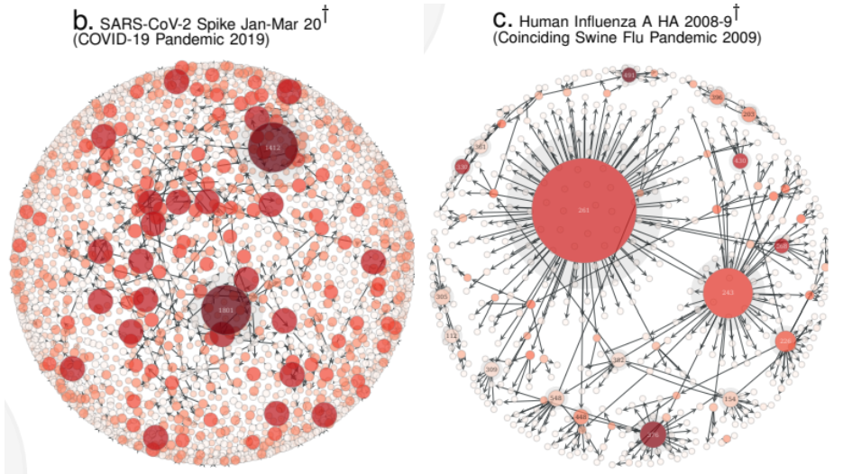
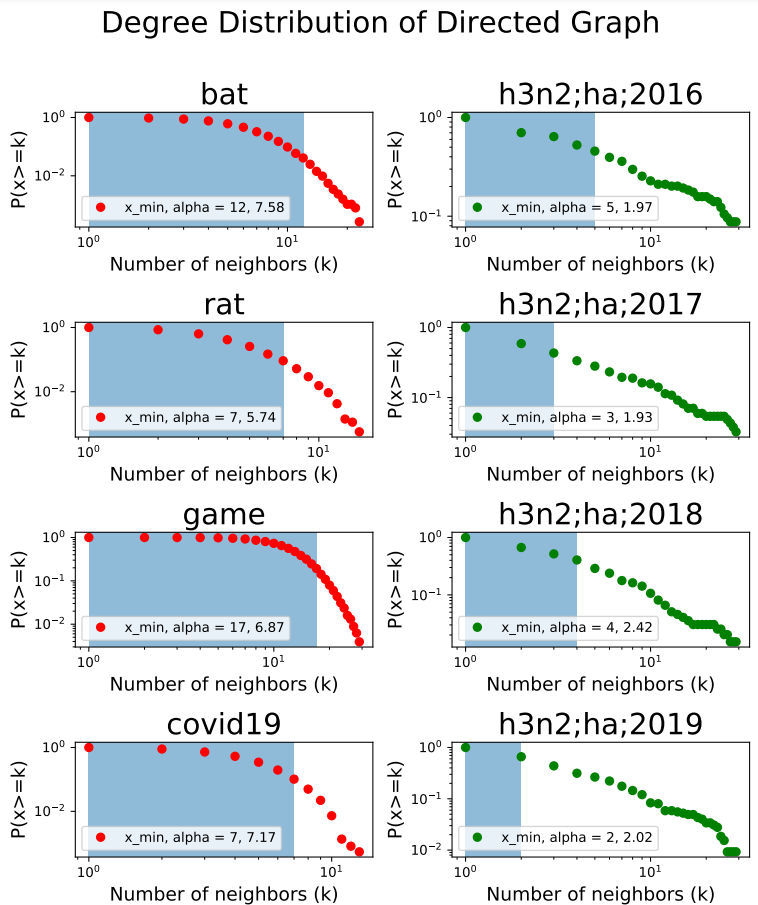

# Graphical Differences Between QNet of Coronavius and Influenza

QNet is a group of decision trees, describing the dependency between different amino acids along the protein sequence of a virus [(Li2020)](https://www.medrxiv.org/content/10.1101/2020.07.17.20156364v3.full.pdf). Each tree yields the probability distribution of the animo acid at a certain position. By attaching all trees together, we obtain complex networks as in the figure above. We notice the visual differences between the networks of coronavirus and influenza. For example, the network for influenza have few central nodes with many connections, while the network for coronavirus have more nodes with high connections. These speculations are vague and untested, but if they were true, this knowledge could help us distinguish highly infectious virus, like coronavirus, from a common influenza.

# Statistical Differences in the Degree Distribution

