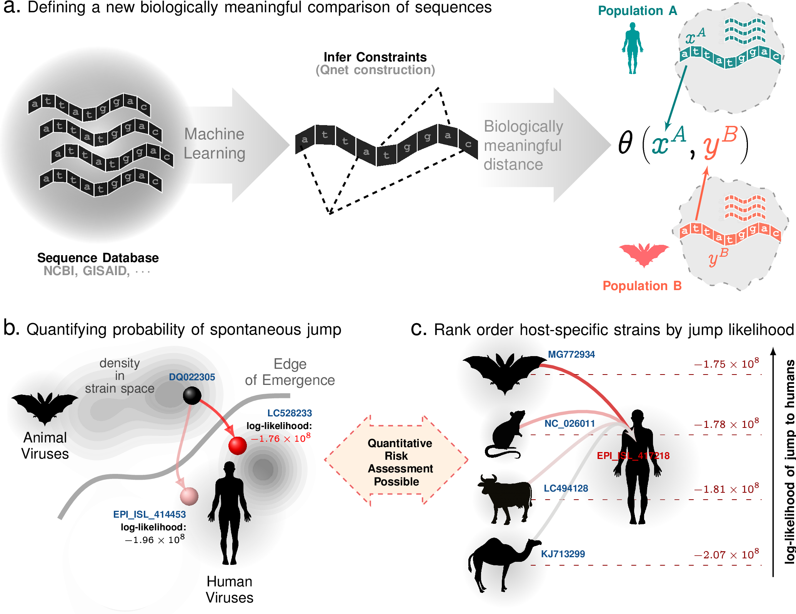
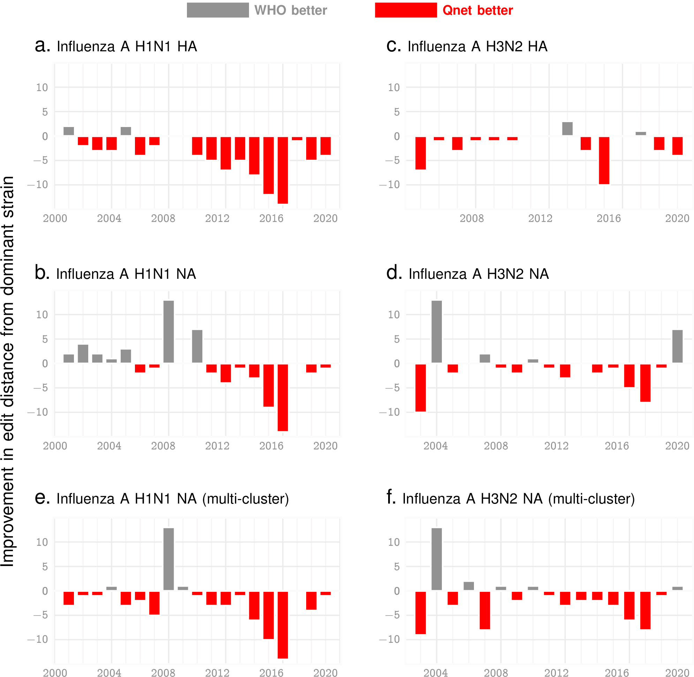
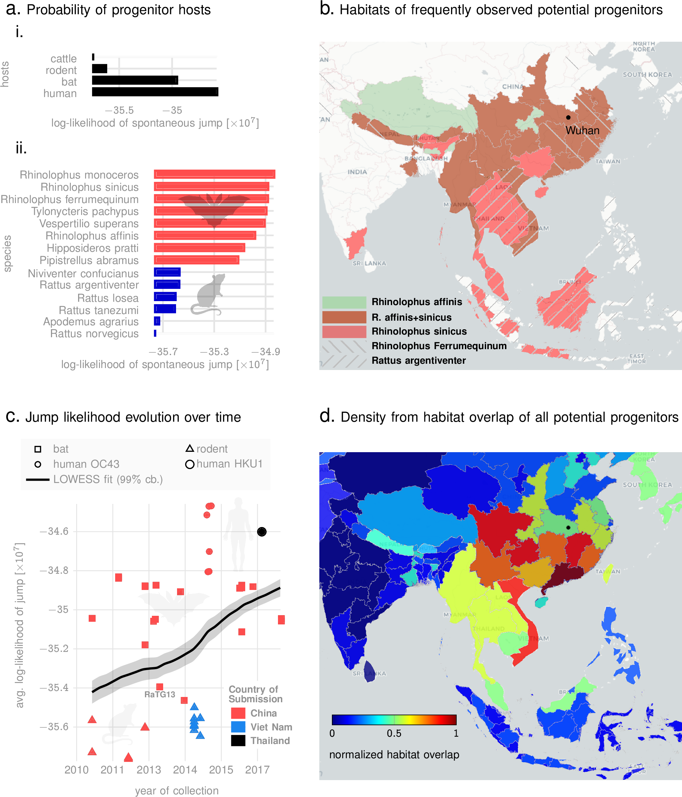

# The q-distance
  As we begin to recover from the COVID-19 pandemic, a key question is if we can avert such disasters in future. Unfortunately, current surveillance protocols   are limited to qualitative impact assessments of viral diversity and habitat  encroachments. These efforts, while vital for  ecosystem monitoring, do not aim to precisely quantify emergence risk across hosts and viral families. In the state-of-the-art, closeness of strains is measured by their edit distance, e.g. how many mutations makes  an avian flu strain   human-adapted. However, this ignores the actual odds of those   mutations in the wild, and  is blind to the true jump risk. Thus, sampling  viral diversity in the wild currently  gives us no indication of which strains are more risky or when we might be at the edge of emergence. In this study, we develop a more meaningful metric for  sequence comparison. Our  metric, the q-distance,  precisely quantifies the probability of spontaneous jump  by random chance. Learning from  patterns of mutations  from large sequence databases, the q-distance  adapts to the specific organism, the background population, and  realistic selection pressures. As our first application, we demonstrate that the q-distance enables improved forecasting of  future strains in the context of the seasonal Influenza epidemic in both hemispheres over World Health Organization (WHO)   recommendations  for the flu-shot composition nearly consistently over past two decades. As our second application, we  investigate  SARS2 origin, and precisely quantify  the likelihood of different  animal species that hosted  an immediate progenitor. In contrast to a qualitative narrative, we  produce a list of related species of bats that have a quantifiably high likelihood of being the source. Additionally, we  identify specific rodents with a credible likelihood of hosting a SARS2 ancestor. Combining  machine learning and  large deviation theory, the analysis framework reported here can open the door to actionable predictions of future pandemics.
  
# Seasonal Epidemic Influenza


# SARS2 Origin Story


# To Do
## Improve Dominant Strain Tracking
```diff
- Improve Northern Hemisphere Influenza predictions
```
## Fast Notebook Example
```diff
- Make a python package that computes distance between current (2019/20) Influenza HA and NA strains
- Make a python package for COVID spike sequences
- We need to make sure that we have a membership test in this packages
- We package the qnet data so that no qnet computation is taking place
- Can we write this part in C/C++ (the distanec calcualtion part)?
```
