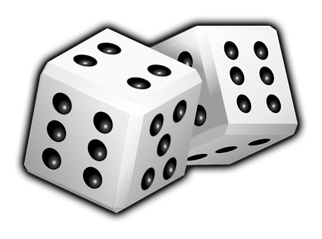

#  Probability Theory 

## Random variables

## Bayes' Theorem

---

#  Bayesian Statsitics

## Baye's Error

## Bayes' Classifier

---

#  Bias vs Variance

---

#  The Scikit-learn Library

---

#  Classification 

## Naive Bayes

## Nearest Neighbor

## Support Vector Machines

## Multi Layer Perceptron

## Random Forest

## AdaBoost

## Stochastic Gradient Descent

---

#  Regression

## LASSO

## Ridge

## LOESS

---

#  Embedding

---

#  Neural Networks

## Feed forward Networks

## Tensorflow Scripting

## Convolutional Neural Networks

---

#  Time Series Analysis

## ARIMA Models

## GARCH Models

## PFSA Models

---

#  Time Series Modeling with Neural Networks

## Recurrent Neural Networks

## Long-short Memory Models

---

#  Autoencoders

## Variational Autoencoders

## Autoencoders and Kolmogorov Complexity

---

#  Case Studies